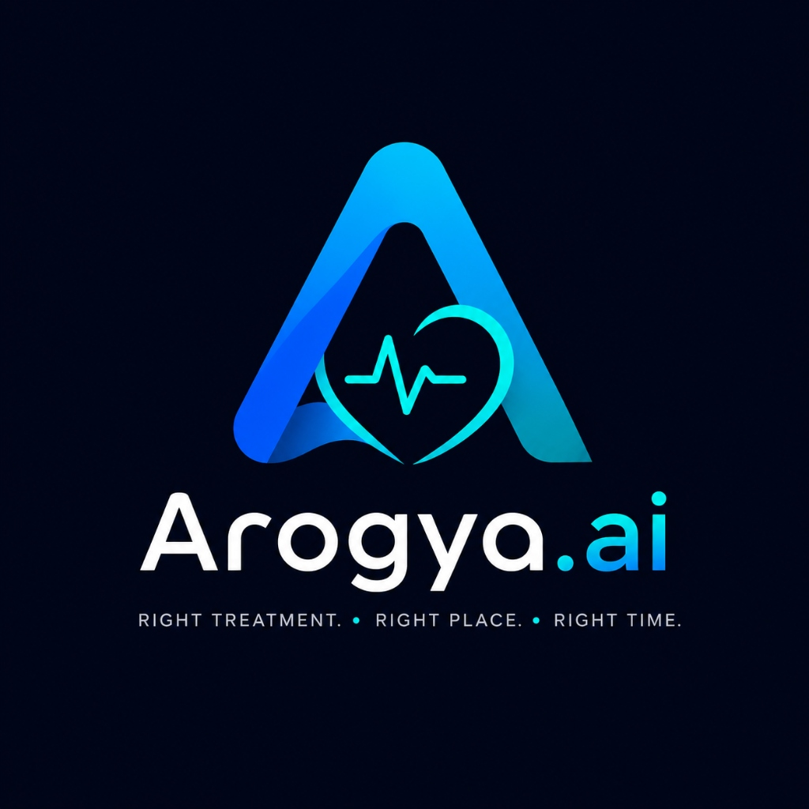
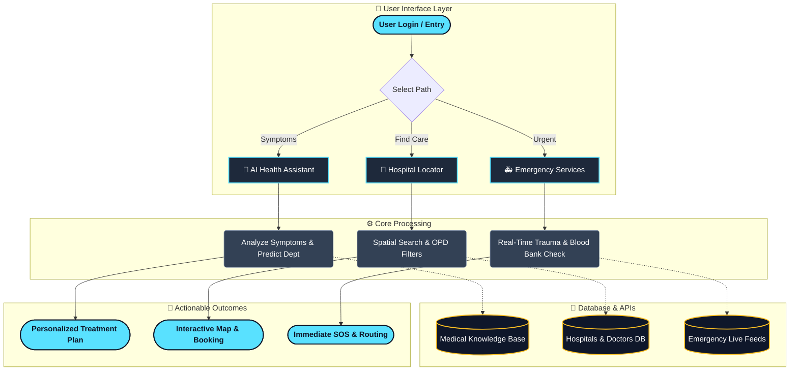

<div align="center">
  
  
  # Arogya.ai
  
  **RIGHT TREATMENT. RIGHT PLACE. RIGHT TIME.**

  [](https://reactjs.org/)
  [](https://vitejs.dev/)
  [](https://tailwindcss.com/)
</div>

<br />

## 🌟 Overview
**Arogya.ai** is an advanced AI-powered healthcare companion designed to bridge the gap between patients and the right medical facilities. By leveraging artificial intelligence, Arogya.ai guides users through a comprehensive **Treatment Journey**, helping them identify their symptoms, find the most appropriate medical departments, and locate nearby government and private hospitals quickly and efficiently.

## ✨ Key Features
- **🧠 AI Treatment Journey**: An intelligent, step-by-step interactive map (Symptoms ➔ Suggested Department ➔ Suggested Tests ➔ Nearby Hospitals ➔ Appointment ➔ Medicine Reminder ➔ Recovery Tracking).
- **🏥 Smart Hospital Locator**: Discover nearby healthcare facilities, complete with OPD timings, department specializations, and real-time maps.
- **🚑 Emergency Assistance**: Quick access to 24/7 emergency wards, trauma centers, and blood banks.
- **🎨 Premium Dark UI**: A highly responsive, dynamic, and aesthetic user interface featuring glassmorphism, subtle micro-animations, and vibrant gradients.
- **🔐 Secure Authentication**: Integrated user login and signup flows to save favorite hospitals and track medical history.

## 🚀 Getting Started

### Prerequisites
Make sure you have Node.js and npm installed on your system.

### Installation

1. **Clone the repository:**
   ```bash
   git clone repo_url
   cd "Arogya.ai"
   ```

2. **Frontend Setup:**
   ```bash
   cd frontend
   npm install
   npm run dev
   ```

3. **Backend Setup (if applicable):**
   ```bash
   cd backend
   pip install -r requirements.txt
   python main.py
   ```

## 🛠️ Technology Stack
- **Frontend**: React, Vite, CSS (Modern flexbox/grid layouts with dark aesthetics)
- **State Management**: Zustand
- **Routing**: React Router DOM
- **Backend**: Python (FastAPI/Flask/Django)

## 🔄 Workflow Structure



## 🤝 Contributing
Contributions are what make the open source community such an amazing place to learn, inspire, and create. Any contributions you make are **greatly appreciated**.

1. Fork the Project
2. Create your Feature Branch (`git checkout -b feature/AmazingFeature`)
3. Commit your Changes (`git commit -m 'Add some AmazingFeature'`)
4. Push to the Branch (`git push origin feature/AmazingFeature`)
5. Open a Pull Request


---
<div align="center">
  <p>Built with ❤️ by Harshita Shakya</p>
</div>
